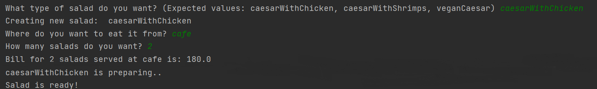

# Topic: *Structural Design Patterns*
## Author: *Gheorghita Anastasia*
------
## Objectives:
&ensp; &ensp; __1. Study and understand the Structural Design Patterns.__

&ensp; &ensp; __2. As a continuation of the previous laboratory work, think about the functionalities that your system will need to provide to the user.__

&ensp; &ensp; __3. Implement some additional functionalities using structural design patterns.__


## Used Design Patterns:

* Proxy
* Flyweight
* Facade


## Implementation

__1. Proxy__

The Proxy pattern ensures that the client can't do anything out of order with the original class since all of his requests pass through the class.

```
public void prepareCaesar(){
        if(makingSalad == null) {
            makingSalad = new MakingSalad(caesarType);
        }
        makingSalad.prepareCaesar();
    }
```

__2. Flyweight__ 

The performance is increased by creating a pool of common Strings and assigning multiple reference variables to the ones with the same content, and only creating new Strings when no match is found.

```
public static CaesarType addSaladToHistory(String caesarType) {
        CaesarType existingSalad = (CaesarType)orderedSalads.get(caesarType);
        if(existingSalad == null) {
            CaesarType newCaesar = new CaesarType(caesarType);
            orderedSalads.put(caesarType, newCaesar);
            System.out.println("Creating new salad: " + caesarType);
            return newCaesar;
        }

        System.out.println("Such salad has already been created, returning you the same");
        return existingSalad;
    }
```

__3. Facade__ 
   
By using the Facade pattern, the client doesn't concern themselves with the logic behind preparing the caesar salad.
```
public class CaesarMakerFacade {
    private CaesarMaker CaesarWithChicken;
    private CaesarMaker CaesarWithShrimps;
    private CaesarMaker VeganCaesar;

    public void CaesarMaker() {
        CaesarWithChicken = new caesarWithChicken();
        CaesarWithShrimps = new caesarWithShrimps();
        VeganCaesar = new veganCaesar();
    }

    public void prepareCaesarWithChicken() {
        CaesarWithChicken.prepareCaesar();
    }

    public void prepareCaesarWithShrimps() {
        CaesarWithShrimps.prepareCaesar();
    }

    public void prepareVeganCaesar() {
        VeganCaesar.prepareCaesar();
    }
}
```

## Screenshot
