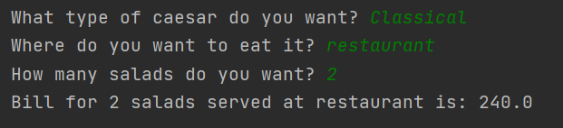

# Topic: *Creational Design Patterns*
### Author: *Gheorghita Anastasia*
------
## Objectives:
__1. Study and understand the Creational Design Patterns.__

__2. Choose a domain, define its main classes/models/entities and choose the appropriate instantiation mechanisms.__

__3. Use some creational design patterns for object instantiation in a sample project.__

## Theory :
In software engineering, creational design patterns are design patterns that deal with object creation mechanisms, trying to create objects in a manner suitable to the situation.

The basic form of object creation could result in design problems or added complexity to the design. Creational design patterns solve this problem by somehow controlling this object creation.

Some examples of this kind of design patterns are :

* Singleton
* Builder
* Prototype
* Object Pooling
* Factory Method
* Abstract Factory

### Main tasks:
__1. Choose an OO programming language and a suitable IDE or Editor (No frameworks/libs/engines allowed).__

__2. Select a domain area for the sample project.__

__3. Define the main involved classes and think about what instantiation mechanisms are needed.__

__4. Based on the previous point, implement atleast 3 creational design patterns in your project.__

## Implementation :
In this project I've implemented 3 creational design patterns: Builder, Prototype and Factory Method with the emphasis on the fundamental object _**Caesar Salad**_.

Builder design pattern is used to build a complex object using simple objects and using a step by step approach. I've created the _CaesarBuilderPattern()_ which provides all necessary methods for creating the salad.

Protoype pattern lets you copy existing objects without making your code dependent on their classes. It is used to avoid subclasses of an object creator in the client application.

The Factory design pattern provides an interface for creating objects in a superclass, but allows subclasses to alter the type of objects that will be created.

## Screenshot
