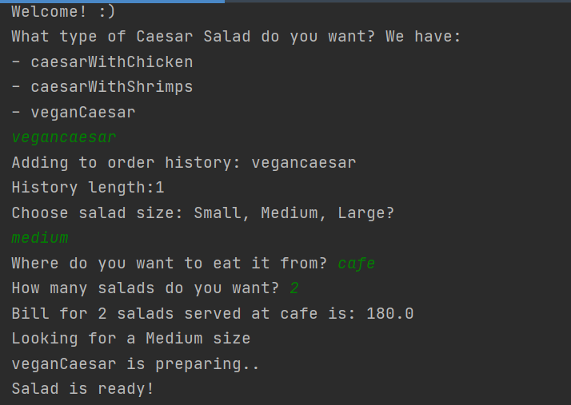
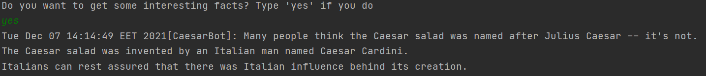

# Topic: *Structural Design Patterns*
## Author: *Gheorghita Anastasia*
------
## Objectives:
&ensp; &ensp; __1. Study and understand the Behavioral Design Patterns.__

&ensp; &ensp; __2. As a continuation of the previous laboratory work, think about what communication between software entities might be involved in your system.__

&ensp; &ensp; __3. Implement some additional functionalities using behavioral design patterns.__


## Used Design Patterns:

* Mediator
* Iterator


## Implementation

__1. Mediator__

If a user object wishes to communicate with another, they can use the chat:

```
public class Chat {
    public static void showMessage(User user, String message) {
        System.out.println(new Date().toString() + "[" + user.getName() + "]: " + message);
    }
}
```

This class contains only one method and makes the parameters and shows the message:

```
public class User {
    private String name;

    public User(String name) {
        this.name = name;
    }

    public String getName() {
        return name;
    }
    public void setName(String name) {
        this.name = name;
    }

    public void sendMessage(String message) {
        Chat.showMessage(this, message);
    }
}
```

The User class defines a sendMessage() method. This method calls upon the static method from the Chat class with this instance of the user and a String as the arguments.

```
    User caesarBot = new User("CaesarBot");

    caesarBot.sendMessage("Many people think the Caesar salad was named after Julius Caesar -- it's not. \nThe Caesar salad was invented by an Italian man named Caesar Cardini. \nItalians can rest assured that there was Italian influence behind its creation.\n");

    User helper = new User("Help");
    helper.sendMessage("Something else?");
```

__2. Iterator__

The Iterator pattern is used to access the members of collections all the while hiding the underlying implementation. 

The Iterator to prints the names of salads. All the salads have their own sector in which they are prepared.

```
public class CaesarTypeRepository implements Sector {
    public String[] salads = {"caesarWithChicken", "caesarWithShrimps", "veganCaesar"};

    @Override
    public Iterator getIterator() {
        return new CaesarTypeIterator();
    }

    private class CaesarTypeIterator implements Iterator {
        int index;

        @Override
        public boolean hasNext() {
            if(index < salads.length) {
                return true;
            }
            return false;
        }

        @Override
        public Object next() {
            if(this.hasNext()) {
                return salads[index++];
            }
            return null;
        }
    }
}
```


## Screenshots

